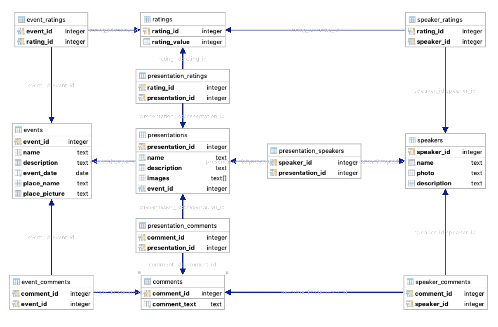

# База данных первого уровня упоротости

Сама структура базы данных довольно проста:

[Загрузить схему базы данных первого уровня в PDF формате](db_scheme_l1.pdf)

Есть три таблицы для основных сущностей: 
  - events - события
  - presentations - презентации/доклады/активности
  - speakers - спикеры

События с презентациями связываются через таблицу event_presentations отношением один ко многим. Аналогичным образом презентации и спикеры через таблицу presentation_speakers. 

В таблице presentations мы решили попробовать поля типа массив в PostgreSQL для картинок. 

Затем, выделили сущности для комментариев (comments) и рейтинга (ratings). Комментарии и рейтинги связываются с основными сущностями через соответствующие таблицы (к примеру, event_ratings, event_comments).

[SQL скрипт создания базы данных](create_db_l1.sql)

